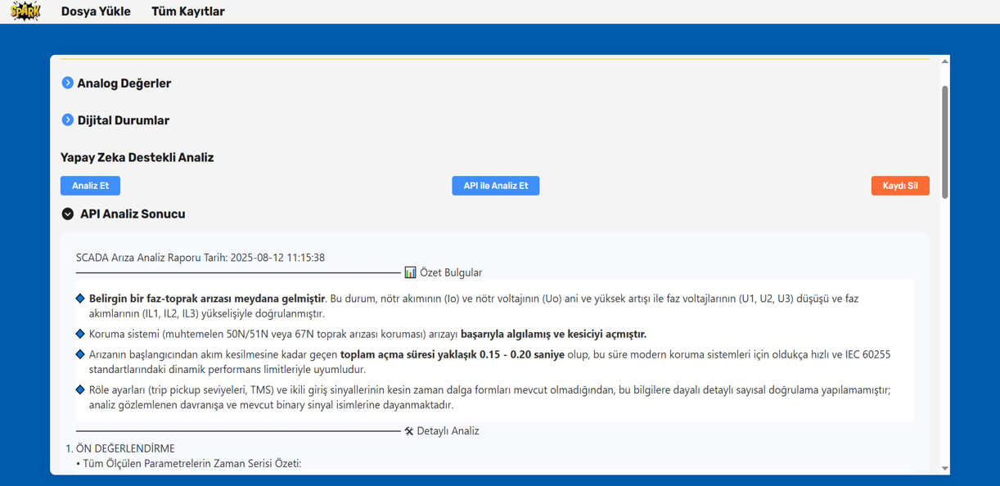
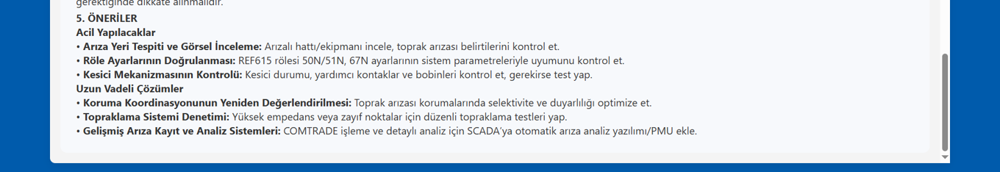

⚡ Enerjisa SCADA – Yapay Zekâ Destekli SCADA Analiz Arayüzü

Bu proje, SCADA sistemlerinden alınan verilerin yapay zekâ ile analiz edilerek kullanıcı dostu bir arayüzde görselleştirilmesini amaçlamaktadır.
Enerji sektöründe gerçek zamanlı veri analizi, erken arıza tespiti ve operasyonel verimlilik için kritik bir rol oynar. Biz de bu projede yerel LLM (Ollama) + Python analiz altyapısı + React tabanlı arayüz ile bu süreci hayata geçirdik.

🚀 Özellikler

SCADA Veri Analizi:
Ölçüm verilerinden yapay zekâ tabanlı çıkarımlar ve hata tespitleri.

Yerel LLM Entegrasyonu (Ollama):
SCADA verilerini doğal dilde açıklama, raporlama ve özetleme.

React Arayüz:
Son kullanıcıya sade, anlaşılır ve görsel olarak zengin bir dashboard.

Grafiksel Görselleştirme:
Zaman serisi verilerinin çizelgeler ve grafiklerle sunulması.

Genişletilebilir Yapı:
Yeni sensörler, ek veri kaynakları veya model güncellemeleri kolayca eklenebilir.

🛠 Kullanılan Teknolojiler

Backend: Python (pandas, scikit-learn, vb.)

Yapay Zekâ: Ollama (Yerel LLM entegrasyonu)

Frontend: React

Veri Kaynakları: SCADA CSV dosyaları

📂 Proje Yapısı
Enerjisa_SCADA/
│
├── backend/            # Python tabanlı analiz kodları
├── frontend/           # React arayüzü
├── models/             # Yapay zekâ modelleri (Ollama, ML, vb.)
├── data/               # Örnek SCADA verileri (CSV)
├── outputs/            # Grafikler, rapor çıktıları
├── Resim1.gif          # Proje arayüzünden örnek görsel
├── Resim1.png          # Ek arayüz görseli
├── Resim3.png          # Ek arayüz görseli
└── README.md           # Bu dosya

📸 Arayüz Görselleri

>
>

⚙️ Kurulum
1. Depoyu klonla
git clone https://github.com/thesyzling/Enerjisa_SCADA.git
cd Enerjisa_SCADA

2. Backend (Python) ortamını kur
cd backend
pip install -r requirements.txt

3. Frontend (React) ortamını kur
cd frontend
npm install
npm start

4. Ollama’yı kur ve çalıştır
ollama run llama3

▶️ Çalıştırma

Backend servisini başlat (Python analiz).

Frontend’i çalıştır (React arayüz).

SCADA verilerini data/ klasörüne yerleştir.

Tarayıcıdan http://localhost:3000 adresine git.

📊 Örnek Çıktı

Zaman serisi grafikler

Arıza tahminleri

Yapay zekâ tarafından üretilen raporlar

💡 Katkı

Projeye katkıda bulunmak isteyenler için:

Fork edin

Yeni bir dal açın (git checkout -b feature/yenilik)

Değişiklikleri commit edin

PR açın 🎉

📬 İletişim

Projeyle ilgili sorular veya öneriler için:
👉 GitHub Issues
👉 ya da doğrudan bizimle iletişime geçebilirsiniz.
