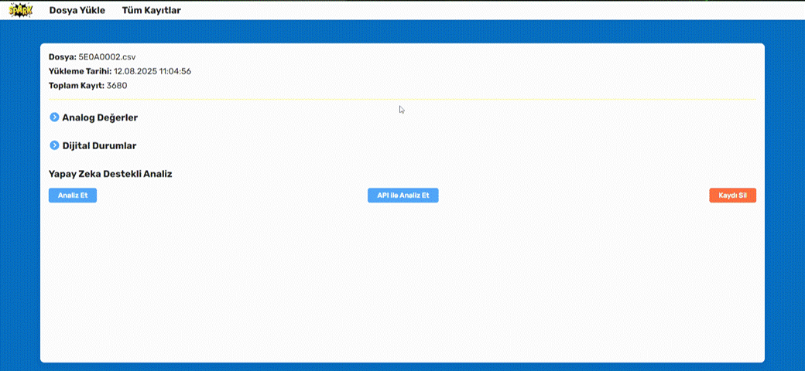

# Enerjisa_SCADA

Yerel LLM tabanlı **SCADA arıza analizi** arayüzü.  
Bu proje, **COMTRADE formatındaki** olay dosyalarını otomatik olarak **CSV’ye dönüştürür**, sinyalleri görselleştirir ve **yerel LLM** kullanarak mühendislik odaklı rapor üretir.

---

## ✨ Özellikler

- **Yerel LLM ile analiz** (Ollama üzerinden)  
  - Olay özeti  
  - Olası arıza tipi & olasılık  
  - Kanıt / göstergeler  
  - İşletme & bakım önerileri  

- **COMTRADE → CSV dönüşümü**  
  - `.cfg + .dat` dosyalarından zaman-serisi CSV üretir  
  - Kanal isimlerini ve metaveriyi korur  

- **Web arayüzü**  
  - Dosya yükleme (COMTRADE veya CSV)  
  - Trend grafikleri (akım/gerilim, dijital sinyaller)  
  - LLM analiz çıktısı paneli  

- **Tamamen lokal çalışma**  
  - İnternete ihtiyaç duymaz  
  - Veriler dışarı çıkmaz  

---

## 📸 Arayüz Görselleri

>


---

## 🛠 Kurulum

### Gereksinimler
- Python 3.10+
- Ollama (LLM için) → [https://ollama.com](https://ollama.com)
- (Opsiyonel) NVIDIA GPU

### Adımlar

```bash
# Repo klonla
git clone https://github.com/thesyzling/Enerjisa_SCADA.git
cd Enerjisa_SCADA

# Sanal ortam
python -m venv .venv
source .venv/bin/activate   # Linux/macOS
.venv\Scripts\activate      # Windows

# Bağımlılıklar
pip install -r requirements.txt
Ollama Modeli Yükle
bash
Kopyala
Düzenle
ollama pull llama3
.env dosyasında model adını ayarla:

env
Kopyala
Düzenle
LLM_MODEL=llama3
🚀 Çalıştırma
Backend
bash
Kopyala
Düzenle
uvicorn app.main:app --reload --host 0.0.0.0 --port 8000
Arayüz
bash
Kopyala
Düzenle
cd ui
npm install
npm run dev
Ardından tarayıcıda aç: http://localhost:3000

📂 Klasör Yapısı
bash
Kopyala
Düzenle
Enerjisa_SCADA/
├─ app/                 # Backend (FastAPI)
│  ├─ main.py
│  ├─ services/
│  │  ├─ comtrade_io.py   # COMTRADE → CSV dönüşüm
│  │  ├─ llm_client.py    # Ollama istemcisi
│  │  └─ analysis.py      # Analiz pipeline
├─ ui/                  # Web arayüzü
├─ data/
│  ├─ raw/              # Yüklenen COMTRADE
│  └─ processed/        # CSV çıktıları
├─ scripts/
│  └─ comtrade_to_csv.py
├─ docs/
│  └─ screenshots/      # Görseller (UI, grafik, rapor)
└─ README.md
⚡ COMTRADE Dönüşümü
Komut satırından hızlı dönüşüm:

bash
Kopyala
Düzenle
python scripts/comtrade_to_csv.py \
  --cfg data/raw/OLAY.cfg \
  --dat data/raw/OLAY.dat \
  --out data/processed/OLAY.csv
📊 LLM Analiz Çıktısı Formatı
LLM, profesyonel SCADA mühendisliği terminolojisiyle şu başlıklarda çıktı üretir:

Olay Özeti

Olası Arıza Tipi ve Olasılık (%)

Kanıt/İndikasyonlar

Öneriler (İşletme/Bakım)

Varsayımlar / Sınırlar

Örnek ekran:

🛣 Yol Haritası
 Gelişmiş öznitelik çıkarımı (RMS, harmonikler, frekans)

 Otomatik olay penceresi seçimi

 Çoklu LLM desteği (model seçimi UI’dan)

 Rapor dışa aktarma (PDF, Word)

 Kullanıcı & rol yönetimi
